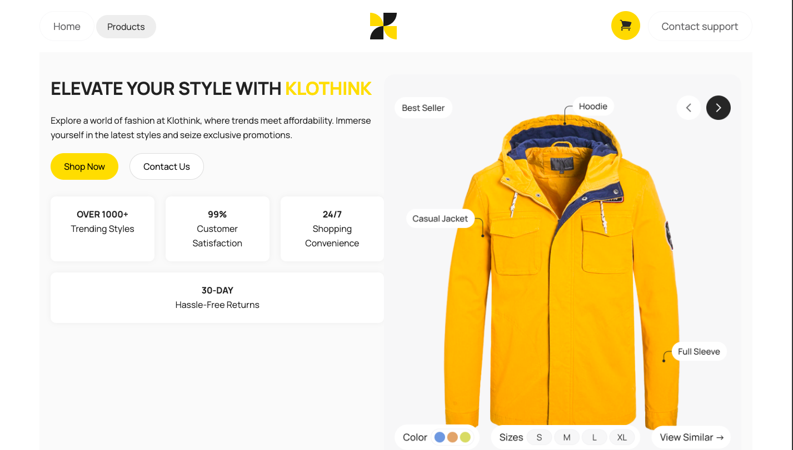

# fakestore
A team project of the Creator IT Academy students, an online store using Fake Store API

## Contributors
This project was developed by:
- [**[Name]**](https://github.com/username1) – Frontend development  
- [**[Yurii Khalus]**](https://github.com/YuraKhalus) – Team Leader, Architect, Teacher
- [**[Marko]**](https://github.com/MarcelloTar) – Frontend development  
- [**[Maks]**](https://github.com/BONBINOVNCH) – Frontend development (API)  
- [**[Tanya]**](https://github.com/TanzerCIJI) – Frontend development  
- [**[Maksym]**](https://github.com/MaksimKopis) – Frontend development 
- [**[Nazar]**](https://github.com/nether1203) – Frontend development 

# Pages

## Product page 
Autor: **[Maks]**
Description: Сторінка про товар
### What was done:
- Main structur and styles for page of product
- Getting information about product from API
- Adaptation

## Page with all products
Autor: [**[Marko]**](https://github.com/MarcelloTar) Description: зробив сторінку де є категорія товарів 
What was done:
    - заголок
    - фільтер
    - категорії товару
    - картка товару
    - слайдер

## Modal window
Autor: **[Maks]**
Description: Модальне вікно корзини
### What was done:
- Main structur and styles for modal window
- Getting information about cart and user from API for modal window
- Adaptation

## Main page (Question Box)
Autor: **[Maksym]**
Description: Головна стоінка інтернет магазину
### What was done:
Я зробив блок з запитанням. Де ви можете задати запитання!

